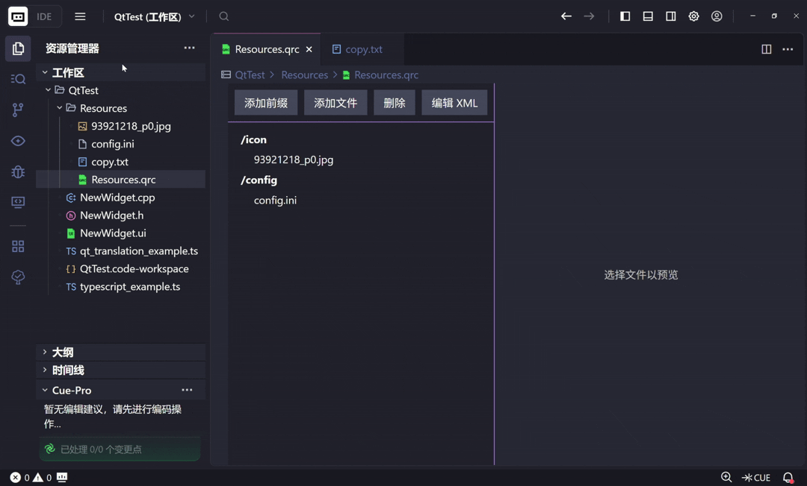
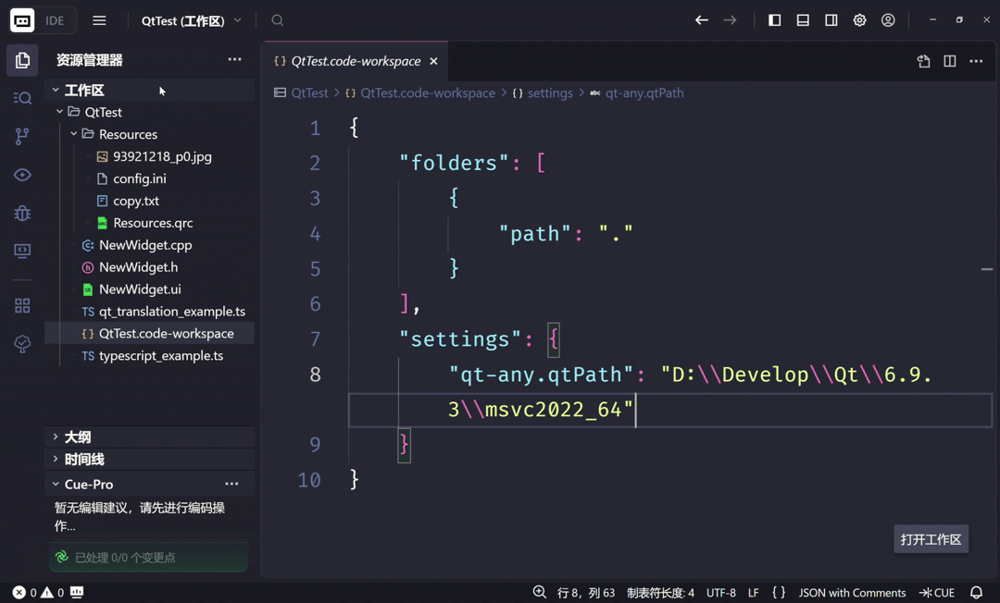
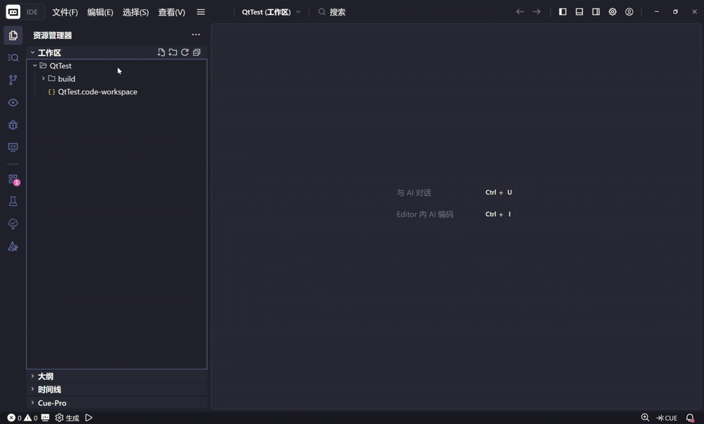
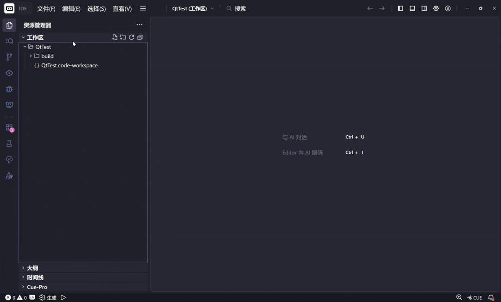

# Qt Any

[English](README.md) | [简体中文](README.zh-CN.md)

Qt Any 是一款强大的 VS Code 扩展，旨在简化您的 Qt 开发工作流程。它提供了一套全面的工具，用于创建 Qt 类、管理资源文件以及集成外部 Qt 工具。

## 功能特性

- **创建 Qt 类**：快速生成兼容 Qt 的 C++ 类，包括 `.h`、`.cpp` 和可选的 `.ui` 文件。
- **可视化 QRC 编辑器**：用于 Qt 资源文件（`.qrc`）的所见即所得编辑器，支持添加/删除/预览操作。
- **外部工具集成**：无缝地在 Qt Designer 中打开 `.ui` 文件，在 Qt Linguist 中打开 `.ts` 文件。
- **本地化**：完全支持英语和简体中文。
- **创建 CMake 项目**：快速创建基于 CMake 的 Qt 项目，包含必要的文件结构和配置。且支持自定义 CMakeLists.txt 的模板
- **右键菜单项目管理配置项**：提供右键菜单项目的启用/禁用配置项，为您提供不同的功能组合。
- **创建项目时拷贝文件**：可以在创建项目时拷贝指定的文件到项目目录（例如`.clang-format`等文件），方便项目初始化。文件指定由于考虑到不同设备文件路径不同的原因不支持在全局配置文件中配置以避免自动同步。

---

## 使用指南

### 1. 创建 Qt 类

轻松生成标准的 Qt 类模板代码。

- **命令**：`Qt Any: Create Qt Class` (非 UI 类) 或 `Qt Any: Create UI Class`。
- **如何使用**：
    1. 在文件资源管理器中的文件夹上点击右键。
    2. 选择 **Qt Any: Create Qt Class**（基于 QObject）或 **Qt Any: Create UI Class**（基于 QWidget）。
    3. 输入类名（例如：`MyWidget`）。
    4. （可选）选择基类（QWidget, QMainWindow, QDialog）。
    5. 选择文件名风格（全小写、保持原样或自定义）。


### 2. 可视化 QRC 编辑器

通过用户友好的图形界面管理您的 Qt 资源文件（`.qrc`）。

- **打开编辑器**：只需在文件资源管理器中点击任意 `.qrc` 文件。
- **功能**：
    - **添加前缀**：创建新的资源前缀（必须以 `/` 开头）。
    - **添加文件**：将文件导入到指定的前缀下。
    - **预览**：点击任意文件（图片、文本）即可在右侧面板预览其内容。
    - **复制资源路径**：在文件节点上点击右键，将资源路径（例如：`:/images/logo.png`）复制到剪贴板。
    - **以 XML 编辑**：如果需要，可切换到原始 XML 编辑模式。




### 3. 外部工具集成

在原生的 Qt 编辑器中打开特定类型的文件。

- **Qt Designer**：在 `.ui` 文件上点击右键 -> **Qt Any: Open in Qt Designer**。
- **Qt Linguist**：在 `.ts` 文件上点击右键 -> **Qt Any: Open in Qt Linguist**。

> **注意**：此功能需要先配置 `qt-any.qtPath` 设置。



### 4. 创建纯 C++ 类

用于创建非 Qt 特定的普通 C++ 类。

- **命令**：`Qt Any: Create C++ Class`。
- **如何使用**：在文件夹上点击右键 -> **Qt Any: Create C++ Class** -> 按照向导操作。

### 5. 创建 CMake 项目

用于创建基于 CMake 的 Qt 项目。

- **命令**：`Qt Any: Create CMake Project`。
- **如何使用**：在文件夹上点击右键 -> **Qt Any: Create CMake Project** -> 按照向导操作。



### 6. 创建项目时拷贝文件

用于在创建项目时拷贝指定的文件到项目目录。

- **配置项**：`qt-any.copyFiles`相关配置项
- **如何使用**：打开对应的配置项，创建文件组，输入要拷贝的文件路径（在磁盘上的绝对路径），在创建项目时选择要拷贝的文件组，即可自动拷贝对应文件组的文件到项目目录（原有同名文件将被覆盖）。



---

## 配置说明

### 1. 配置 Qt 安装路径

要使用外部工具（Designer/Linguist），您必须配置 Qt 安装路径。

1. 打开 VS Code 设置 (`Ctrl+,`)。
2. 搜索 `qt-any`。
3. 设置 **Qt Any: Qt Path** 为您的 Qt 套件目录（包含 `bin`、`include`、`lib` 的文件夹）。

**示例**：
- Windows: `C:\Qt\6.5.0\mingw_64`
- macOS: `/Users/username/Qt/6.5.0/macos`
- Linux: `/opt/Qt/6.5.0/gcc_64`

```json
{
    "qt-any.qtPath": "C:\\Qt\\6.5.0\\mingw_64"
}
```

### 2. 配置右键菜单启用项

用于配置右键菜单项目的启用/禁用配置项。

- **配置项**：`qt-any.menus`相关配置项
- **如何使用**：打开对应的配置项，将需要启用的项目勾选上，即可在右键菜单中看到对应的项目。